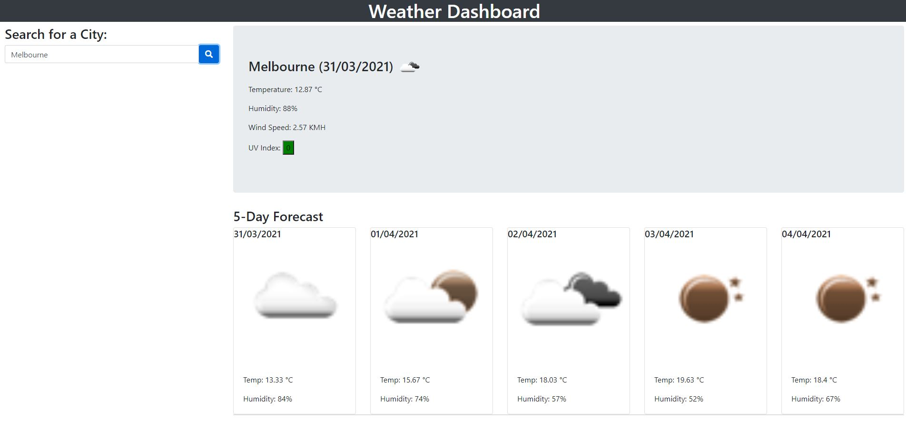

# Weather_Dashboard

## Table of Contents

- [Description]
- [Usage]
- [Links]
- [Questions]

## Description

A simple website that allows the user to check the weather of the location they are in. The user will receive a detailed forcast for the day, as well as a five day forecast.

## Usage

The user will first require to enter the name of the city they want the weather for, once the user clicks on the search button the weather will be displayed, as per below. 

## Links

Link to GitHub Pages: <https://glevii.github.io/Weather_Dashboard/>

## Questions

For any questions feel free to reach out:  
Email: <georginalevitki@gmail.com>
